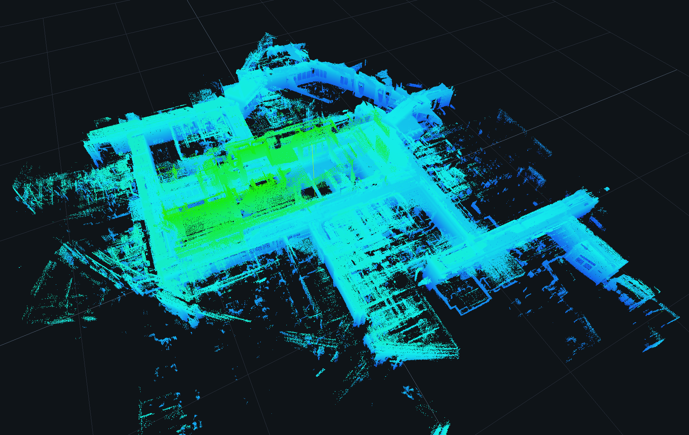
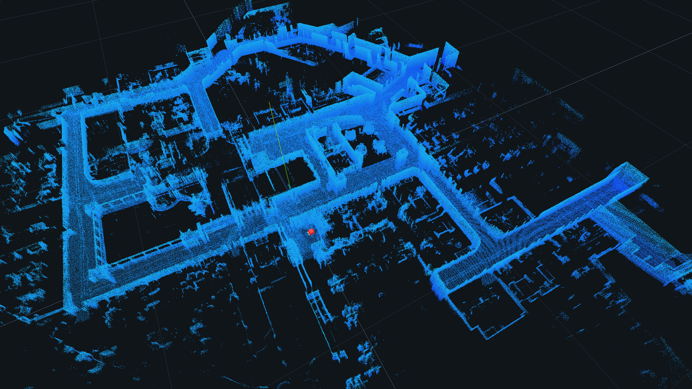

# FAST-LIO

[](#license)
[](Cargo.toml)

**语言:** [English](README.md) · 简体中文

**FAST-LIO** 是 [FAST-LIO2](https://github.com/hku-mars/FAST_LIO) 的纯 Rust 移植版本——一个计算高效、鲁棒的紧耦合 LiDAR-惯性里程计（LIO）系统。它使用流形上的迭代误差状态卡尔曼滤波（IEKF）将原始 LiDAR 点云与 IMU 数据紧耦合融合，并维护增量 k-d 树（ikd-Tree）地图，从而实现高频率、低漂移的里程计与建图。

核心 crate **不包含任何 I/O 或 ROS 依赖**：整个前端是一个纯库，只消费带时间戳的 IMU 样本和 LiDAR 扫描帧，输出位姿、速度、偏置和局部地图。因此可以轻松嵌入、单元测试，并从任意数据源（rosbag、自定义文件格式、实时传感器）驱动。

## 目录

- [特性](#特性)
- [状态](#状态)
- [工作区结构](#工作区结构)
- [环境要求](#环境要求)
- [快速开始](#快速开始)
- [建图效果](#建图效果)
- [命令行参考](#命令行参考)
- [参数配置](#参数配置)
- [作为库使用](#作为库使用)
- [数据源](#数据源)
- [输出文件](#输出文件)
- [测试](#测试)
- [性能说明](#性能说明)
- [路线图](#路线图)
- [署名与许可证](#署名与许可证)
- [参考文献](#参考文献)

## 特性

- 完整的 FAST-LIO2 流水线（Rust 实现）：
  - **预处理** — 支持 Livox Avia（`CustomMsg` 风格）、Velodyne、Ouster 和 MARSIM，可选的点云特征提取（平面 / 边缘分类）。
  - **IMU 处理** — 自动初始化（通过 S² 流形估计重力、陀螺仪/加速度计偏置、协方差）、前向传播和逐点反向去畸变。
  - **IEKF（`esekfom`）** — 在 23 自由度流形状态 `{pos, rot, offset_R_L_I, offset_T_L_I, vel, bg, ba, grav(S²)}` 上的迭代误差状态卡尔曼滤波，包含 FAST-LIO2 的 `update_iterated_dyn_share_modified` 公式与在线外参估计。
  - **ikd-Tree** — 增量 k-d 树，支持惰性删除、盒子删除、降采样插入、子树重平衡和 O(log n) k-NN 搜索。
  - **建图** — 基于 FOV 的滑动局部地图、体素网格降采样和增量地图更新。
- 核心 crate 零 I/O —— 无 ROS、无 PCL。
- **解耦驱动层** — 所有硬件访问都位于 `fast-lio-driver` crate 中（每种品牌一个模块，重型厂商 SDK 用 feature 隔离）；算法核心从不接触厂商 SDK。
- **实时 Livox 支持（无需 ROS）** — `fast-lio-driver` 通过官方 Livox SDK2（经由 `livox-sdk2` crate）直接连接 HAP / Mid-360 激光雷达，并将点云 + 内置 IMU 推入流水线。
- 数值保真的移植，逐模块对照 C++ 实现验证（见[测试](#测试)）。
- 为完整自主栈预留：`lidar-map`（占据/体素地图）和 `lidar-nav`（规划/导航）crate。

## 状态

| 模块 | 文件 | 状态 |
|---|---|---|
| SO(3) / S² / 流形数学 | `src/math/{so3,s2,manifold}.rs` | ✅ 已测试 |
| 过程模型（`f`、`f_x`、`f_w`、Q） | `src/model.rs` | ✅ 数值微分验证 |
| 迭代误差状态卡尔曼滤波 | `src/esekf.rs` | ✅ 已测试 |
| 预处理（4 种 LiDAR 类型） | `src/preprocess.rs` | ✅ |
| IMU 初始化 / 传播 / 去畸变 | `src/imu_processing.rs` | ✅ |
| ikd-Tree | `src/ikdtree.rs` | ✅ 暴力法交叉验证 |
| 激光建图主循环 | `src/laser_mapping.rs` | ✅ 端到端 |
| 离线驱动 + 合成数据源 | `crates/fast-lio-app` | ✅ 端到端 |
| 实时 Livox SDK2 数据源（`livox-sdk2` feature） | `crates/fast-lio-driver/src/livox.rs` | ✅ 可编译（需硬件验证） |
| 真实数据集验证（C++ 黄金对比） | — | 🔜 待数据集 |
| `lidar-map` / `lidar-nav` | — | 🔜 规划中 |

## 工作区结构

```
fast-lio/
├── Cargo.toml                 # 虚拟工作区
└── crates/
    ├── fast-lio/              # 核心算法库（发布名为 `fast-lio`）
    │   └── src/
    │       ├── math/          #   so3.rs · s2.rs · manifold.rs
    │       ├── model.rs       #   过程模型与过程噪声
    │       ├── esekf.rs       #   迭代误差状态卡尔曼滤波
    │       ├── preprocess.rs  #   LiDAR 驱动与特征提取
    │       ├── imu_processing.rs
    │       ├── ikdtree.rs     #   增量 k-d 树
    │       ├── laser_mapping.rs # 主流水线
    │       ├── data_source.rs #   DataSource trait + 合成模拟器
    │       └── types.rs       #   归一化 SensorData 消息
    ├── fast-lio-driver/       # 设备适配器（每种品牌一个模块）
    │   └── src/
    │       ├── lib.rs         #   DriverParams + open() 工厂
    │       ├── livox.rs       #   Livox SDK2（feature: livox-sdk2）
    │       ├── velodyne.rs    #   机械式 LiDAR（开发中）
    │       ├── ouster.rs      #   机械式 LiDAR（开发中）
    │       └── hesai.rs       #   机械式 LiDAR（开发中）
    ├── lidar-map/             # （占位）占据/体素地图 —— 未来
    ├── lidar-nav/             # （占位）规划与导航 —— 未来
    └── fast-lio-app/          # 离线/实时驱动二进制（不发布）
```

算法核心（`fast-lio`）**与厂商 SDK 完全解耦**：它只消费归一化的 [`SensorData`](crates/fast-lio/src/types.rs)。所有硬件访问都位于 `fast-lio-driver` 中，其适配器将各品牌原始输出翻译为该格式。依赖方向：`fast-lio-app → fast-lio-driver → fast-lio`。

## 环境要求

- **Rust 工具链 ≥ 1.85**（edition 2024）。可通过 [rustup](https://rustup.rs) 安装。
- 使用实时 Livox 设备时：目标机器需要 `cmake` 和 C/C++ 编译器（`livox-sdk2` crate 会编译官方 C++ SDK2），并能访问激光雷达所在网络。

## 快速开始

```bash
# 1) 运行离线演示（合成圆周轨迹，IMU 200 Hz + LiDAR 10 Hz，时长 20 s）
cargo run -p fast-lio-app --release -- --sim

# 2) 在真实激光雷达上运行（无需 ROS）—— 驱动通用，按名字选择品牌
cargo run -p fast-lio-app --release -- --driver livox --config mid360_config.json

# 3) 结果默认写入 ./out，也可用 --out <dir> 指定
cargo run -p fast-lio-app --release -- --sim --out my_output
```

演示使用内置的 `SimSource` 驱动整个流水线，输出：

- `pos_log.txt` — 每帧位姿（时间、欧拉角、位置、速度、陀螺仪偏置），与 C++ 节点格式一致；
- `map.pcd`（默认；或 `.xyz` / `.ply`，见[`--out-format`](#命令行参考)）— ikd-Tree 中存储的世界系地图点。

## 建图效果

以下截图由**当前 Rust 移植版本**在真实环境中使用 Mid-360 实时运行生成：

| | |
|---|---|
|  |  |
| 流水线构建的完整 3D 点云地图，展示整个环境（墙体、结构物与地形），未做任何过滤。 | 同一张地图去掉部分 Z 轴（高度）切片后的效果，使可通行道路/路径在 3D 中清晰可见。 |

## 命令行参考

`fast-lio-app`（`crates/fast-lio-app` 中的二进制）**与驱动解耦**：用 `--driver <name>` 选择激光雷达品牌，CLI 从不绑定某个具体传感器型号。

```
usage: fast-lio-app [common opts] --sim | --driver <name> [driver opts]

common opts:
  --out <dir>              output directory (default "out")
  --out-format <fmt>       map file format: xyz | pcd | ply (default pcd)
  --scan-ms <ms>           scan frame period in ms (default 100)
  --duration <secs>        auto-stop after N seconds and save (default: run until Ctrl-C)
  --map-voxel <m>           global map voxel size (default 0.5; smaller = denser)
  --surf-voxel <m>          per-frame scan voxel size (default 0.5)
  --point-filter-num <n>    keep every Nth point (default 2; 1 = keep all)

modes:
  --sim                    synthetic demo data (default)
  --driver <name>          connect to a real LiDAR. Supported names:
    livox                  Livox (HAP / Mid-360) via SDK2, needs --config
    velodyne | ouster | hesai | marsim   spinning LiDAR (adapter may be WIP)

driver opts:
  --config <file>          vendor config file (Livox SDK2 JSON)
  --ip <addr>              LiDAR network address (spinning LiDARs)
  --port <port>            UDP data port (spinning LiDARs)

examples:
  fast-lio-app --sim
  fast-lio-app --driver livox --config mid360_config.json
  fast-lio-app --driver velodyne --ip 192.168.1.100 --port 2368
```

| 选项 | 默认值 | 说明 |
|---|---|---|
| `--sim` | — | 使用合成的 `SimSource` 演示数据（与 `--driver` 互斥）。 |
| `--driver <name>` | — | 按名字选择激光雷达驱动（`livox`、`velodyne`、`ouster`、`hesai`、`marsim`）。未知名字会以明确错误拒绝；尚未实现的适配器（如 `hesai`）会明确提示。 |
| `--config <file>` | — | 厂商配置文件（Livox SDK2 JSON，与 Livox Viewer / driver2 用的相同）。 |
| `--ip <addr>` | — | 激光雷达网络地址（机械式雷达）。 |
| `--port <port>` | — | 机械式雷达点云包的 UDP 数据端口。 |
| `--scan-ms <ms>` | `100` | 激光雷达扫描帧周期（毫秒）（10 Hz → 100）。越小帧率越高。 |
| `--duration <secs>` | — | 运行 N 秒后自动停止并保存地图。默认一直运行直到 Ctrl-C。 |
| `--map-voxel <m>` | `0.5` | 全局地图体素尺寸（m）。取值范围：**> 0**，实际建议 **≥ 0.05**。越小地图越密（如 `0.1`）。 |
| `--surf-voxel <m>` | `0.5` | 逐帧扫描体素尺寸（m）。取值范围：**> 0**，实际建议 **≥ 0.05**；建议与 `--map-voxel` 一致。 |
| `--point-filter-num <n>` | `2` | 每隔 N 个点保留一个。取值范围：**≥ 1**（`1` 保留全部点，最密但最慢）。 |
| `--out <dir>` | `out` | 轨迹和地图文件的输出目录（不存在会自动创建）。 |
| `--out-format <fmt>` | `pcd` | 地图文件格式：`xyz`、`pcd` 或 `ply`。见[输出文件](#输出文件)。 |

注意事项：

- `--live <config>` 保留为 **`--driver livox --config <config>` 的向后兼容别名**。
- 新增激光雷达品牌只需在 `fast-lio-driver` 中实现对应适配器并在 `open()` 注册，**CLI 无需改动**（见 [`fast-lio-driver`](crates/fast-lio-driver)）。
- `livox` 驱动以**直接里程计模式**运行（`feature_extract_enable = false`）：SDK2 流被路由到单条扫描线，因为 SDK 不暴露逐点 ring 索引。机械式雷达则使用逐点 `ring`/`time` 字段。
- **IMU 加速度从 g 转换到 m/s²**（见 `crates/fast-lio-driver/src/livox.rs` 中的 `ACC_G_TO_MPS2`；如果固件直接上报 m/s²，将其设为 `1.0`）。
- 帧时间戳使用本地单调时钟（到达时间）。若需要精确的 PTP/UTC 同步，`Packet::timestamp()` 已对外暴露。

## 参数配置

流水线通过 [`LioConfig`](crates/fast-lio/src/laser_mapping.rs) 配置，它镜像了 C++ 节点的 ROS 参数 / yaml 文件。构造一个 `LioConfig` 并传给 `LaserMapping::new(&cfg)`；所有字段都有合理默认值，因此 `..Default::default()` 就能得到一个可运行的配置。

| 参数 | 类型 | 默认值 | 说明 |
|---|---|---|---|
| `lidar_type` | `LidarType` | `Avia` | `Avia` / `Velo16` / `Oust64` / `Marsim` |
| `feature_extract_enable` | `bool` | `false` | 是否启用平面/边缘特征提取 |
| `point_filter_num` | `i32` | `2` | 直接模式下每隔 N 个点保留一个 |
| `blind` | `f64` | `0.01` | 最小距离阈值（m²） |
| `n_scans` / `scan_rate` | `usize` / `i32` | `16` / `10` | LiDAR 线数与扫描速率（Velodyne 时间计算用） |
| `timestamp_unit` | `TimeUnit` | `Us` | 原始点时间戳字段的单位 |
| `filter_size_surf` / `filter_size_map` | `f32` | `0.5` / `0.5` | 体素尺寸（扫描 / 地图，m） |
| `cube_len` | `f64` | `1000` | 局部地图盒子边长（m）—— launch 文件使用 `1000` |
| `det_range` | `f32` | `300` | FOV 滑动逻辑使用的探测距离（m） |
| `fov_deg` | `f64` | `180.0` | 预留字段（尚未接入 FOV 逻辑；当前滑动地图只用 `det_range`） |
| `gyr_cov` / `acc_cov` | `f64` | `0.1` | IMU 测量协方差 |
| `b_gyr_cov` / `b_acc_cov` | `f64` | `1e-4` | 偏置随机游走协方差 |
| `extrinsic_est_en` | `bool` | `true` | 是否在线估计 LiDAR↔IMU 外参 |
| `time_sync_en` | `bool` | `false` | 是否启用 LiDAR↔IMU 时间偏移估计器 |
| `time_offset_lidar_to_imu` | `f64` | `0.0` | 初始 LiDAR 到 IMU 时间偏移（s） |
| `extrinsic_t` | `[f64; 3]` | `[0,0,0]` | 初始外参平移 |
| `extrinsic_r` | `[f64; 9]` | 单位阵 | 初始外参旋转（行主序 3×3） |
| `max_iteration` | `usize` | `4` | 每帧 IEKF 迭代次数 |

## 作为库使用

将核心 crate 添加为依赖，然后向其喂传感器数据。核心**纯粹是一个库**：无 I/O、无 ROS —— 由你提供样本。

### 1. 添加依赖

```toml
[dependencies]
fast-lio = "0.1"
```

### 2. 实现数据源

任何时间有序的 [`SensorData`](crates/fast-lio/src/types.rs) 流都可以。实现 [`DataSource`](crates/fast-lio/src/data_source.rs) trait（可以是 bag 读取器、socket 处理器或你自己的模拟器）：

```rust
use fast_lio::types::SensorData;

struct MySource;

impl fast_lio::data_source::DataSource for MySource {
    fn next(&mut self) -> Option<SensorData> {
        // 从你的 bag / socket / 设备读取一个样本并返回
        todo!()
    }
}
```

### 3. 配置并运行流水线

```rust
use fast_lio::laser_mapping::{LaserMapping, LioConfig, LioResult};
use fast_lio::types::{LidarType, SensorData, TimeUnit};

let cfg = LioConfig {
    lidar_type: LidarType::Velo16,
    filter_size_surf: 0.5,
    filter_size_map: 0.5,
    ..Default::default()
};

let mut mapping = LaserMapping::new(&cfg);

// `data_source` 是任意 `DataSource`（见第 2 步）
while let Some(sample) = data_source.next() {
    match sample {
        SensorData::Imu(imu) => mapping.add_imu(&imu),
        SensorData::LidarAvia(msg) => mapping.add_lidar_avia(&msg),
        SensorData::LidarStandard(msg) => mapping.add_lidar_standard(&msg),
    }
    // 一帧同步数据就绪 -> 运行一次 LIO 迭代
    if mapping.has_data() {
        if let Some(res) = mapping.run_once() {
            // res: LioResult { time, pos, quat, vel, bg, ba, map_points, .. }
            println!("pose @ {:.3}s: {:?}", res.time, res.pos);
        }
    }
}
```

### 公共 API 一览

| 条目 | 路径 | 用途 |
|---|---|---|
| `LaserMapping` | `fast_lio::laser_mapping::LaserMapping` | 主前端：`new(&LioConfig)`、`add_imu`、`add_lidar_avia`、`add_lidar_standard`、`has_data`、`run_once` |
| `LioConfig` | `fast_lio::laser_mapping::LioConfig` | 流水线配置（见[参数配置](#参数配置)） |
| `LioResult` | `fast_lio::laser_mapping::LioResult` | 每帧输出：`time`、`pos`、`quat [w,x,y,z]`、`vel`、`bg`、`ba`、`map_points`、`effct_feat_num`、`res_mean` |
| `SensorData` | `fast_lio::types::SensorData` | 归一化输入枚举：`Imu` / `LidarAvia` / `LidarStandard` |
| `LidarType` | `fast_lio::types::LidarType` | `Avia` / `Velo16` / `Oust64` / `Marsim` |
| `TimeUnit` | `fast_lio::types::TimeUnit` | `Sec` / `Ms` / `Us` / `Ns` —— 逐点时间戳字段的单位 |
| `DataSource` | `fast_lio::data_source::DataSource` | 任意时间有序传感器源的 trait |
| `KdTree` | `fast_lio::ikdtree::KdTree` | 增量 k-d 树（地图）：`build`、`nearest_search`、`add_points`、`delete_point_boxes`、`validnum` |

测量模型对高级用户开放：`LaserMapping` 将 `kf`（`EseKf`）和 `ikdtree`（`KdTree`）作为公共字段保留（与 C++ 节点结构一致），因此你可以用自定义的 `h_share_model` 自己驱动 IEKF 更新。

## 数据源

`fast_lio::data_source` 提供：

- **`DataSource`** — 任何输入（rosbag 读取器、文件、socket…）实现的 trait。样本必须时间有序。
- **`SimSource`** — 确定性合成生成器（先静止初始化阶段，再沿墙/地面平面做圆周运动）。用于演示和 CI 风格冒烟测试；不能替代真实数据验证。

### 真实设备 —— 通过 SDK2 使用 Livox（无需 ROS）

启用 `livox-sdk2` feature（`fast-lio-app` 默认启用）后，`fast-lio-driver` crate 会**通过以太网直接连接激光雷达**，无需 ROS：

```bash
cargo run -p fast-lio-app --release -- --driver livox --config mid360_config.json [--scan-ms 100] [--duration 120]
```

程序会持续运行直到 **Ctrl-C**（优雅退出：保存轨迹与地图）或 `--duration <secs>` 到时自动停止。

要求与注意事项：

- 一份**有效的 Livox 配置文件**（`mid360_config.json`，与 Livox Viewer / driver2 使用的相同），列出设备 IP / 子网。SDK2 的 `Sdk::new` 在文件缺失或格式错误时会直接 abort。
- 目标机器需要 `cmake` 和 C++ 编译器（该 crate 会编译并内嵌官方 SDK2）。
- 支持的设备：**HAP / Mid-360**（SDK2）。不覆盖较旧的 Avia SDK1 系列。
- 流水线以**直接里程计模式**运行（`feature_extract_enable = false`）：SDK2 流被路由到单条扫描线，因为 SDK 不暴露逐点 ring 索引。
- 单位：点为米；IMU 陀螺仪为 rad/s；IMU 加速度从 **g** 转换为 m/s²
  （`crates/fast-lio-driver/src/livox.rs` 中的 `ACC_G_TO_MPS2` —— 若固件直接上报 m/s²，设为 `1.0`）。
- 帧时间戳使用本地单调时钟（到达时间）。若需要设备 PTP/UTC 时间戳进行精确同步，`Packet::timestamp()` 已对外暴露。

## 输出文件

每次运行，程序会写入：

| 文件 | 格式 | 说明 |
|---|---|---|
| `pos_log.txt` | 文本 | 轨迹，C++ `dump_lio_state_to_log` 格式：`time RPY(deg) pos vel bg` |
| `map.pcd` | ASCII PCD | `x y z intensity` —— PCL / rviz 工具可读（默认） |
| `map.xyz` | 文本（每行 `x y z`） | 累积的世界系地图（通过 `--out-format xyz`） |
| `map.ply` | ASCII PLY | `x y z intensity` —— CloudCompare / MeshLab 可直接打开（通过 `--out-format ply`） |

> `intensity` 是从传感器透传的原始 LiDAR 反射强度（Livox 为 SDK2 的 `reflectivity` 0–255；合成演示固定填 `100.0`）。算法不使用该值。

所有格式都可与 C++ 实现产生的日志直接对比验证。

## 测试

```bash
cargo test --workspace       # 42 个单元测试
cargo clippy --workspace --all-targets
```

测试覆盖：

- SO(3)/S² 流形往返（`boxplus ∘ boxminus ≈ id`）与几何不变量；
- 过程模型雅可比矩阵与有限差分对照（`df_dx`、`df_dw`）；
- IEKF 更新行为（位置/旋转可观测性、无效测量语义）；
- ikd-Tree k-NN 结果与暴力法、盒子删除、降采样插入交叉验证；
- 平面拟合与体素降采样。

端到端：`fast-lio-app` 演示处理约 200 帧合成数据，点面残差收敛到厘米级。

## 性能说明

- 用 `--release` 构建；工作区启用了 `lto = "thin"` 和 `codegen-units = 1`。
- 可考虑 `RUSTFLAGS="-C target-cpu=native"` 让线性代数自动向量化。
- 移植保持了 C++ 热路径的低分配（复用缓冲区、手写二叉堆用于 k-NN）。
- 已知简化：ikd-Tree 子树重建在调用线程内联执行（C++ 版本用后台线程）；语义一致，仅最坏延迟不同。`rayon` 可用于并行化逐点匹配循环。

## 路线图

1. 与 C++ 实现进行真实数据集验证（轨迹 ATE/RPE、逐阶段黄金对比）。
2. 在硬件上验证 `LivoxSource`；改用 PTP/UTC 时间戳以更紧密同步。
3. 实现 rosbag / 自定义文件的 `DataSource`。
4. `lidar-map`：为规划提供增量占据/体素地图。
5. `lidar-nav`：在地图上进行路径规划与避障。
6. 将 `fast-lio`（以及后续的 `lidar-map`、`lidar-nav`）发布到 crates.io。

## 署名与许可证

本项目移植自以下开源作品；为保持数值保真，尽可能保留了原始算法、结构和变量命名：

- [FAST-LIO2](https://github.com/hku-mars/FAST_LIO) — Xu 等，HKU Mars Lab
- [ikd-Tree](https://github.com/hku-mars/ikd-Tree) — Yixi Cai
- [IKFoM](https://github.com/hku-mars/IKFoM) / MTK — HKU / University of Bremen（C. Hertzberg 等）

本仓库新增的 Rust 代码以 **MIT OR Apache-2.0** 许可证发布（见 [`Cargo.toml`](Cargo.toml)）。移植的代码保留原始项目的版权条款（BSD 风格声明）；重新分发前请查阅上游仓库。

## 参考文献

- W. Xu, Y. Cai, D. He, J. Lin, F. Zhang, *FAST-LIO2: Fast Direct LiDAR-inertial Odometry*, IEEE Transactions on Robotics, 2022.
- Y. Cai, W. Xu, F. Zhang, *ikd-Tree: An Incremental K-D Tree for Robotic Applications*, arXiv:2102.10808, 2021.
- D. He, W. Xu, F. Zhang, *Kalman Filters on Differentiable Manifolds*, arXiv:2102.03804, 2021.
